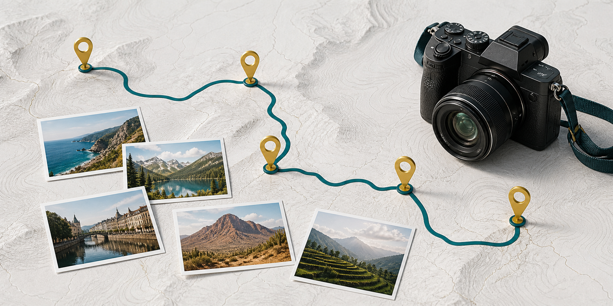
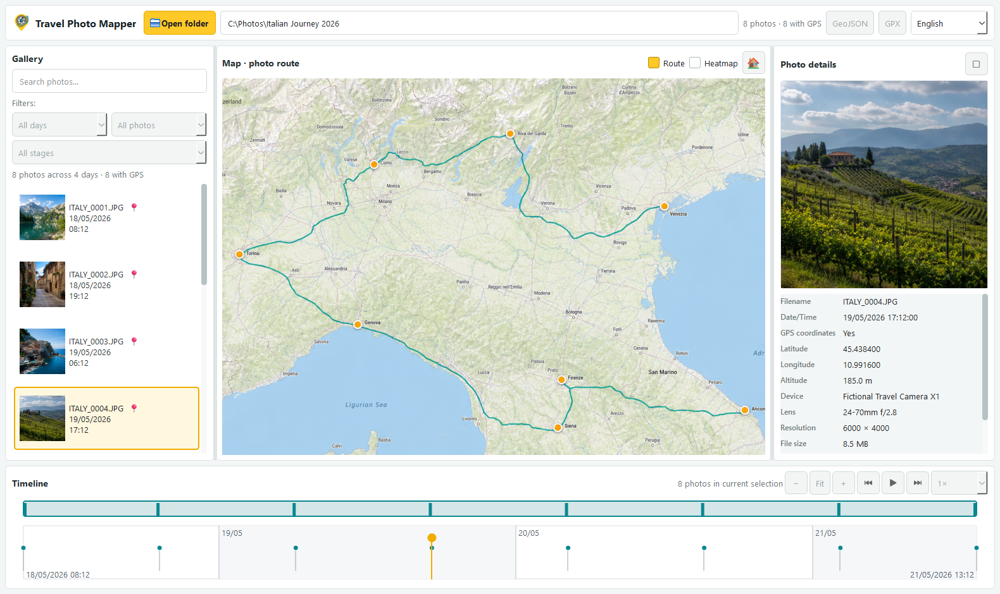

# Travel Photo Mapper

<p align="center">
  
</p>

**Travel Photo Mapper** is a desktop application for exploring travel
photos by place and time. Point it at a folder and it builds an interactive
map, gallery, timeline, and metadata catalog without modifying the originals.



## Highlights

- Recursively scans folders containing JPEG, PNG, TIFF, HEIC, and HEIF images.
- Reads EXIF capture time, GPS coordinates, altitude, camera, lens, and image
  dimensions.
- Connects the gallery and map in both directions: selecting a photo highlights
  its marker, while selecting a marker opens the corresponding photo.
- Groups dense locations with marker clustering and provides route and heatmap
  overlays.
- Offers an interactive timeline with zoom, panning, density overview, date
  source indicators, and adjustable chronological playback.
- Filters by date, estimated trip stage, filename, and GPS availability.
- Opens originals in a window or full screen with zoom, 1:1 view, fit-to-window,
  panning, and previous/next navigation.
- Exports the current filtered selection to GeoJSON or GPX.
- Provides Italian and English interfaces, with automatic system-language
  detection and a persistent preference.



## How It Works

1. Open a folder containing travel photos.
2. Travel Photo Mapper scans its subfolders in a background thread.
3. EXIF metadata and thumbnails are cached locally for faster subsequent scans.
4. Use the gallery, map, timeline, search field, and filters to explore the trip.
5. Open any selected photo in the built-in viewer or in its default application.
6. Export the visible selection when you need portable geographic data.

The yellow route is a chronological connection between geotagged photos. It is
not a recorded GPS track and should not be interpreted as the exact path taken.

## Quick Start

### Windows

```bat
run_windows.bat
```

The script creates `.venv`, installs the runtime dependencies when necessary,
and launches the application.

### macOS and Linux

```bash
chmod +x run_macos_linux.sh
./run_macos_linux.sh
```

### Manual Setup

```bash
python -m venv .venv
```

Activate the environment for your shell, then run:

```bash
python -m pip install --upgrade pip
python -m pip install -r requirements.txt
python main.py
```

## Download Windows Setup

The Windows setup is available in the Github release tag.


## Build the Windows Installer

The Windows release pipeline uses PyInstaller for the standalone executable and
Inno Setup 6 for the installer.

Prerequisites:

- a working project environment created by `run_windows.bat`;
- [Inno Setup 6](https://jrsoftware.org/isinfo.php).

Build the executable and installer:

```bat
build_windows.bat
```

Outputs:

```text
dist\TravelPhotoMapper.exe
dist\installer\TravelPhotoMapper-Setup-1.0.0.exe
```

The setup wizard supports two installation modes:

- **Current user:** installs under the user's local Programs directory in
  `AppData` and does not require administrator privileges.
- **All users:** installs under `Program Files` and requests elevation through
  Windows UAC.

For unattended deployments, select the mode with `/CURRENTUSER` or `/ALLUSERS`.

Build only the standalone executable:

```bat
build_windows.bat -SkipInstaller
```

Reuse already-installed build dependencies:

```bat
build_windows.bat -SkipDependencies
```

Both switches can be combined.

## Local Data and Privacy

Travel Photo Mapper never writes metadata into the original photos. The SQLite
catalog and generated thumbnails are stored in the per-user application data
directory returned by Qt's `QStandardPaths.AppDataLocation`.

Cached entries are validated using the file path, size, and modification time,
so unchanged photos do not need to be analyzed again.

## Network Access

The map view loads Leaflet, the marker-clustering and heatmap plugins, and
OpenStreetMap tiles over the internet. Photo scanning, metadata extraction,
thumbnail generation, caching, filtering, and the photo viewer operate locally.

## Project Structure

```text
main.py                  Application entry point
app_info.py              Product name and version
models/                  Photo data model
services/                Scanning, EXIF, cache, thumbnails, trips, and exports
ui/                      Main window, map, timeline, and photo viewer
assets/                  Application icon sources
images/                  README artwork
packaging/               PyInstaller specification and Windows metadata
installer/               Inno Setup project
tests/                   Unit and UI logic tests
```

## Tests

```bash
python -m unittest discover -s tests -v
```

The test suite covers translations, EXIF parsing, persistent caching, trip-stage
generation, filtered exports, map interactions, timeline behavior, original
image loading, and scan cancellation.


## License

This project is distributed under the terms of the [MIT License](LICENSE).

## Disclaimer

The software is distributed on an "AS IS" BASIS, WITHOUT WARRANTIES OR CONDITIONS OF ANY KIND, either express or implied.
